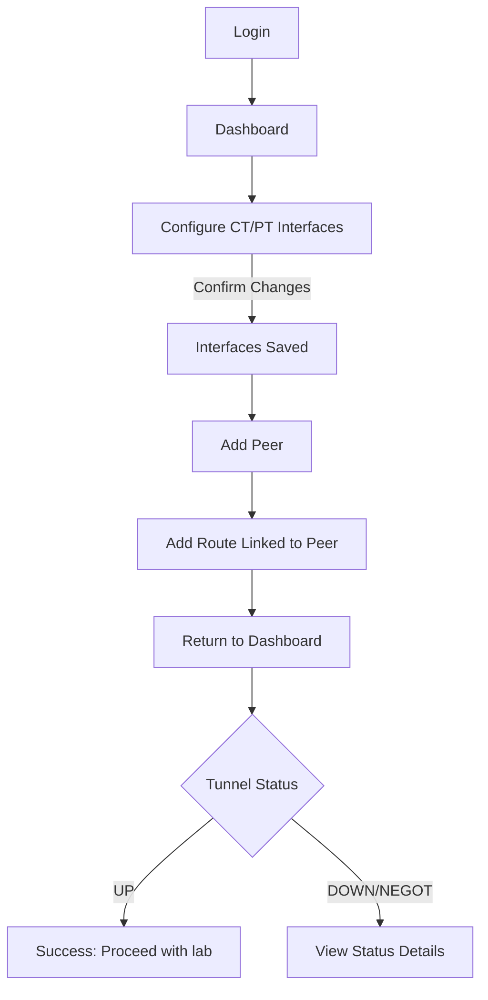
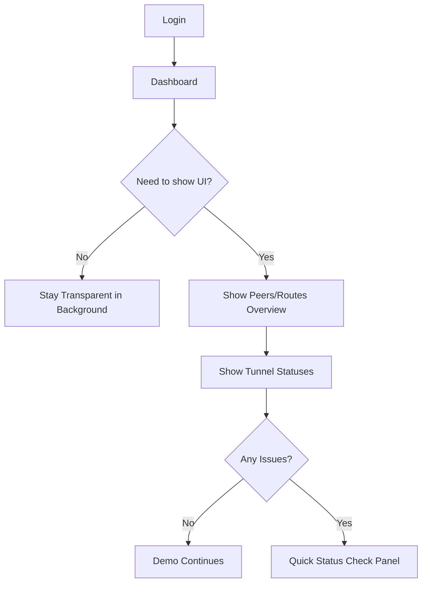
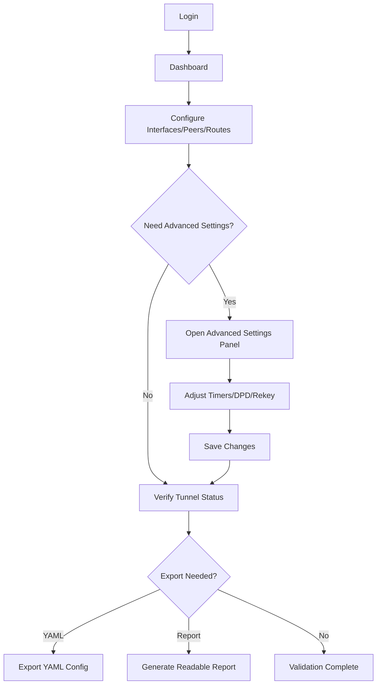

<!-- UX design content will be appended sequentially through collaborative workflow steps -->

## Executive Summary

### Project Vision

Encryptor-Sim-BMAD is a virtual network appliance that simulates a TACLANE/KG encryptor inside lab environments (primarily CML, but also KVM), enabling realistic IPsec-based testing and demos without physical hardware. The web UI exists to configure and monitor the appliance quickly and confidently, so engineers can focus on validating network behavior rather than wrestling with setup.

### Target Users

- Government network engineers validating routing and security behavior in lab topologies  
- Sales engineers preparing reliable, customer-facing demos  
- Solution architects testing multi-vendor designs before expensive integration runs  
- Lab automation developers who need API-driven scale and repeatability  

### Key Design Challenges

- Make initial configuration fast and unmistakably successful (clear “tunnel up” confirmation).  
- Balance powerful network controls with a UI that feels calm and trustworthy.  
- Support advanced users without overwhelming first-time users under time pressure.  

### Design Opportunities

- A purpose-built dashboard that communicates “encryptor is working” at a glance.  
- Streamlined peer and route setup flows that feel faster than manual router configuration.  
- UX patterns that reinforce realism and credibility (e.g., transparent status, diagnostic clarity).

## Core User Experience

### Defining Experience

The core experience is fast, confident management of peers and routes: users can reach configuration quickly, enter precise values, execute create/update/delete actions, and get unambiguous confirmation that the operation succeeded. The UI’s purpose is operational clarity — configure, verify, monitor — without distraction.

### Platform Strategy

- Primary platform is a web UI running locally on the appliance (CML or KVM).  
- A minimal shell wrapper exists only for management interface setup; no other CLI workflow is required.  
- The UI must be fully self-contained and never depend on cloud services.

### Effortless Interactions

- Reach peer/route configuration in one obvious step from landing.  
- Input forms prevent errors through clear field labeling and validation.  
- Success feedback is immediate and unmistakable after every operation.  
- Status visibility is persistent — the dashboard always answers “is the encryptor healthy?”

### Critical Success Moments

- User creates or updates a peer/route and sees a clear “success” state without ambiguity.  
- The dashboard shows clean, trustworthy tunnel/interface status at a glance.  
- If configuration fails, the error is precise and actionable, preserving trust.

### Experience Principles

- **Operational clarity over decoration**: every element earns its place.  
- **Fast path to configuration**: the shortest route to peers and routes wins.  
- **Confidence through feedback**: every action ends with a clear success signal.  
- **Status always visible**: the appliance’s health is never hidden.

## Desired Emotional Response

### Primary Emotional Goals

- Confidence that configuration actions are correct and will succeed.  
- Calm focus — a clean, straightforward environment with no ambiguity.  
- Control over outcomes, with clear feedback at every step.

### Emotional Journey Mapping

- First landing: clarity and orientation, zero confusion.  
- During configuration: efficient, steady progress with reassuring feedback.  
- After success: clean closure — “done, confirmed, move on.”  
- If something fails: clear, human-readable guidance that preserves trust.

### Micro-Emotions

- Prioritize: confidence, calm, control, relief.  
- Avoid: anxiety, uncertainty, frustration, skepticism.

### Design Implications

- Immediate orientation on landing; no guessing where to go.  
- Confirmations must be explicit and unmissable after every action.  
- Status dashboard must feel trustworthy and legible at a glance.  
- Error messages must be human-readable, specific, and actionable; no raw or cryptic errors.

### Emotional Design Principles

- **Clarity beats cleverness**: the UI never makes users wonder.  
- **Feedback is a promise**: every action ends with a clear, trustworthy outcome.  
- **Quiet confidence**: visual calm that supports focus and control.

## UX Pattern Analysis & Inspiration

### Inspiring Products Analysis

- **Cisco Meraki Dashboard**: North star for operational simplicity. Removes complexity from network configuration, uses consistent Cisco design patterns, and is stable/reliable in everyday use.  
- **Stripe Dashboard**: Clean, readable, calm, and efficient. The UI feels intentional and trustworthy, reducing cognitive load while handling complex financial operations.  
- **Cisco UCM (Anti-Example)**: Configurations buried across many menus, weak monitoring visibility; creates confusion and friction.

### Transferable UX Patterns

- **Navigation Simplicity**: Single, obvious entry point for core configuration (Meraki).  
- **Calm Visual Hierarchy**: Clear typography, generous spacing, and focused layouts (Stripe).  
- **Reliability Signals**: UI that feels stable, rarely hangs, with predictable interactions (Meraki).  
- **Monitoring at a Glance**: High-visibility status surfaces; avoid hiding health behind menus.

### Anti-Patterns to Avoid

- Deep menu nesting that hides critical configuration (UCM).  
- Sparse or hard-to-find monitoring status (UCM).  
- Interfaces that feel cluttered or overly dense under pressure.

### Design Inspiration Strategy

**What to Adopt:**
- Meraki’s operational simplicity and clear configuration paths.  
- Stripe’s calm, clean presentation and readability.

**What to Adapt:**
- Cisco-style structural consistency, but with fewer layers and clearer prioritization.  

**What to Avoid:**
- UCM-style buried configuration and low-visibility monitoring.

## Design System Foundation

### 1.1 Design System Choice

Chakra UI (themeable component system) as the current foundation.

### Rationale for Selection

- Already aligned with the PRD stack (React + Chakra UI).  
- Fast delivery with reliable, accessible components.  
- Themeable enough to achieve the calm, confident visual tone we want.

### Implementation Approach

- Use Chakra components as the default UI building blocks.  
- Define a centralized theme for color, typography, spacing, and status tokens.  
- Keep layout and component usage consistent across dashboard and configuration flows.

### Customization Strategy

- Build a minimal, consistent set of custom components only when Chakra primitives are insufficient.  
- Maintain a design-token layer to make a future migration to Cisco Magnetic UI feasible if approved.  
- Favor composable patterns over one-off styling to reduce migration friction later.

## 2. Core User Experience

### 2.1 Defining Experience

A fast, guided sequence: log in → configure CT/PT interfaces → add peers → associate routes → immediately see tunnel statuses and health on the main page. The experience should feel “that simple,” with everything you need visible on one clean dashboard.

### 2.2 User Mental Model

Users expect a straightforward appliance workflow: set interfaces, define peers, link routes, then verify status. Their baseline comparison is antiquated TACLANE UIs or router/firewall hacks with no real UI. That makes simplicity, speed, and clarity feel like a leap forward.

### 2.3 Success Criteria

- Users complete interface + peer + route setup quickly without confusion.  
- Every critical configuration change is explicitly confirmed.  
- The main page immediately shows all peers, routes, and tunnel status.  
- Feedback is clear enough that users feel confident and move on.

### 2.4 Novel UX Patterns

Primarily established patterns (forms + status dashboard), elevated by simplicity and visibility. The “everything you need on the main page” status view is the differentiator, not a novel interaction.

### 2.5 Experience Mechanics

**1. Initiation:** Clear login and landing page with obvious “Configure Interfaces / Peers / Routes” entry points.  
**2. Interaction:** Focused, structured forms with validation; minimal steps.  
**3. Feedback:** Explicit success confirmations for critical changes; inline errors when invalid.  
**4. Completion:** Main page displays complete, live tunnel status and peer/route list — users see the system working instantly.

## Visual Design Foundation

### Color System

**Core palette (calm, trustworthy, modern):**
- Primary: #1F5EA8 (trustworthy blue)
- Primary Dark: #174A84
- Accent: #2AA39A (teal for highlights)
- Background: #F7F9FC
- Surface: #FFFFFF
- Border/Divider: #E3E8EF
- Text Primary: #0F172A
- Text Secondary: #475569

**Status colors:**
- Success: #14804A
- Warning: #B45309
- Error: #B42318
- Info: #2563EB

**Use notes:**
- High contrast for status and confirmations.
- Avoid overly saturated color; keep it calm and professional.

### Typography System

- Primary font: IBM Plex Sans (modern, professional, readable)
- Monospace: JetBrains Mono (for IPs, keys, logs, and routes)
- Scale: clear hierarchy with strong headings and legible body text
- Emphasis on readability for configuration forms and status tables

### Spacing & Layout Foundation

- Base spacing unit: 8px (airier, consistent, easy to scale)
- Layout: clean, wide margins and generous vertical rhythm
- Card-based surfaces for configuration sections and dashboard status
- Tables with comfortable row height for scanability

### Accessibility Considerations

- Contrast ratios meet or exceed WCAG AA for text and status indicators
- Status color is always paired with text/icon to avoid color-only meaning
- Interactive elements sized for comfortable mouse accuracy

## Design Direction Decision

### Design Directions Explored

Six directions explored: Meridian, Slate Console, Signal Flow, Atlas Split, Lumen White, Gridline Ops.

### Chosen Direction

**Gridline Ops** as the primary direction, with Meridian as a secondary influence.

### Design Rationale

- Gridline best supports the core task frequency (peer/route management) with table-first clarity.  
- High scanability aligns with “clean, confident, and quick.”  
- Meridian’s calm, airy feel can soften the table-heavy layout without reducing data visibility.

### Implementation Approach

- Use Gridline layout as the primary dashboard and list views (table-centric).  
- Borrow Meridian’s spacing and card framing for calmness and readability.  
- Keep status chips prominent and always visible in tables.

## User Journey Flows

### Ronnie — Fast Setup & Verification

**Goal:** Configure CT/PT, add peer + route, confirm tunnel up.  
**Success:** Tunnel status shows UP on dashboard; peer and route visible.

### Mark — Demo Readiness & Status Visibility

**Goal:** Verify pre-configured peers/routes and display operational status when asked.  
**Success:** Dashboard clearly shows peers, routes, and tunnel status.

### Jenny — Advanced Validation & Export

**Goal:** Validate multi-vendor configs and adjust advanced settings when needed.  
**Success:** Export/report shows defaults + deviations clearly.

### Journey Patterns

- **Dashboard-first entry** for immediate orientation and status.  
- **Critical confirm only for CT/PT interface changes** to keep flow fast.  
- **Peer → Route → Status** is the consistent core loop.  
- **Advanced settings are opt-in** via panel/modal to avoid clutter.

### Flow Optimization Principles

- Minimize steps to “tunnel up” confirmation.  
- Keep peers/routes/status always visible from primary screens.  
- Surface only deviations from defaults in advanced/report views.  
- Use explicit confirmations only when changes can disrupt connectivity.

## Component Strategy

### Design System Components

From Chakra UI:
- Buttons, IconButtons, Forms (Input/Select), Tabs, Tables, Cards, Alerts, Badges, Toasts
- Modals/Drawers for advanced settings and confirmations
- Page layout primitives (Grid, Stack, Flex)

### Custom Components

#### Status Summary Bar
**Purpose:** Instant health snapshot (tunnels up, peers, routes, health).  
**Usage:** Dashboard top.  
**States:** Normal, warning, error.  
**Accessibility:** Status color + icon + label.

#### Peer/Route Table
**Purpose:** Core operational listing and actions.  
**Usage:** Dashboard + Peers/Routes pages.  
**States:** Loading, empty, populated, error.  
**Variants:** Peers vs Routes.  
**Accessibility:** Column headers, row focus, keyboard navigation.

#### Tunnel Status Row
**Purpose:** Compact, high‑signal status with latency/last activity.  
**Usage:** Dashboard and peer detail.  
**States:** Up/Negotiating/Down.  
**Accessibility:** Status chip + text.

#### Interfaces Config Panel
**Purpose:** CT/PT/MGMT configuration.  
**Usage:** Dedicated page.  
**States:** Default, dirty, saving, error.  
**Accessibility:** Clear labels, validation messages.

#### Advanced Settings Panel (Modal/Drawer)
**Purpose:** DPD timers, rekeying, other advanced options.  
**Usage:** Peer detail page.  
**States:** Default, saving, error.  
**Accessibility:** Focus trap, keyboard close.

#### Config Export Panel
**Purpose:** Export YAML or human‑readable report.  
**Usage:** Peer list or global settings.  
**States:** Ready, generating, error.  
**Accessibility:** Download buttons with descriptive labels.

#### Confirmation Modal (Critical Changes)
**Purpose:** Confirm CT/PT interface changes.  
**Usage:** Before applying changes.  
**States:** Confirm, cancel, error.  
**Accessibility:** Explicit “Confirm” + “Cancel” buttons, focus trap.

#### Empty State Cards
**Purpose:** First‑run guidance.  
**Usage:** Peers/Routes empty lists.  
**States:** Empty only.  
**Accessibility:** Clear action buttons.

### Component Implementation Strategy

- Use Chakra for all primitives, custom components built as composable wrappers.  
- Dedicated edit pages/windows for peers and routes (no inline editing).  
- Bulk actions supported in peer/route tables (select + toolbar).  
- Consistent status chips and confirmation modals across flows.

### Implementation Roadmap

**Phase 1 (Core):** Status Summary Bar, Peer/Route Table, Interfaces Config Panel, Confirmation Modal  
**Phase 2 (Ops):** Tunnel Status Row, Advanced Settings Panel  
**Phase 3 (Enhance):** Config Export Panel, Empty State Cards, bulk action toolbar polish

## UX Consistency Patterns

### Button Hierarchy

**When to Use:** Every action set; always one clear primary action.  
**Visual Design:** Primary = solid blue; Secondary = outline; Destructive = red.  
**Behavior:** Primary on the right in modals; left in forms if single column.  
**Accessibility:** Focus ring visible; keyboard activation supported.  
**Variants:** Primary, secondary, destructive, ghost (rare).

### Feedback Patterns

**When to Use:** Every create/update/delete, validation error, and status change.  
**Visual Design:** Toasts for transient success; inline for form errors; banners for system issues.  
**Behavior:** Success toast auto-dismiss; error banners persist until resolved.  
**Accessibility:** Announce via ARIA live regions; include text + icon.

### Navigation Patterns

**When to Use:** Global movement between Dashboard, Interfaces, Peers, Routes.  
**Visual Design:** Top nav with clear active state; avoid deep nesting.  
**Behavior:** Dashboard is home; peers/routes reachable in one click.  
**Accessibility:** Visible focus, keyboard tab order, clear labels.

### Form Patterns & Validation

**When to Use:** All configuration inputs.  
**Visual Design:** Labels above inputs; monospace for IPs/keys; helper text for formats.  
**Behavior:** Inline validation on blur; prevent submit if invalid.  
**Accessibility:** Error text linked to fields; required fields indicated.

## Responsive Design & Accessibility

### Responsive Strategy

- Desktop/laptop only; the UI is optimized for mouse + keyboard.  
- Minimum supported width: 1024px (modern web‑app standard).  
- No condensed mobile view; below minimum width shows a friendly “expand your window” message.

### Breakpoint Strategy

- Desktop-first approach.  
- Primary breakpoint at 1024px; above this, full layout.  
- Optional secondary at 1280px+ for wider tables and multi‑column panels.

### Accessibility Strategy

- Target WCAG 2.1 AA for V1.  
- High‑contrast text, clear focus indicators, keyboard navigation for all inputs and tables.  
- Status is never color‑only; always paired with labels/icons.

### Testing Strategy

- Desktop browser testing: Chrome, Firefox, Edge, Safari.  
- Keyboard-only navigation pass.  
- Automated a11y checks (axe or Lighthouse).  
- Color‑contrast verification for all status states.

### Implementation Guidelines

- Use semantic HTML and proper form labeling.  
- Maintain ARIA for tables, status chips, and toasts.  
- Provide visible focus rings and skip‑to‑content link.
