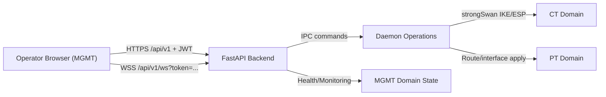

# Architecture

The Encryptor Simulator uses a three-domain isolation model to separate management traffic from encrypted tunnel payloads and plaintext forwarding behavior.

## Isolation Domains

- **MGMT**: control-plane and operator access. HTTPS API/UI and automation access terminate here.
- **CT (Ciphertext Transport)**: encrypted tunnel transport path (IKE/ESP).
- **PT (Plaintext Transport)**: cleartext network path for routed application traffic.

The design assumes these domains are isolated at interface and policy level. Management-plane actions configure runtime behavior but must not collapse CT/PT isolation guarantees.

## Component Boundaries

- **Frontend (React)**: renders operator workflows and consumes backend REST/WebSocket APIs.
- **Backend API (FastAPI)**: validates/authenticates requests, applies business rules, and emits normalized response envelopes.
- **Daemon operations layer**: performs privileged networking actions and strongSwan/nftables interactions.

Backend-to-daemon calls cross an explicit IPC boundary. Privileged operations are not performed directly in UI code.

## Data and Control Flow

1. Operator authenticates over HTTPS on MGMT.
2. UI calls `/api/v1/*` endpoints with JWT bearer token.
3. API performs auth checks, validation, and issues daemon commands where required.
4. Runtime status is exposed through REST monitoring endpoints and WebSocket telemetry events.

## Control/Data Separation Diagram

## Security Boundaries

- JWT auth is required for protected API routes.
- Errors use a standard RFC 7807 format.
- Success payloads use `{ data, meta }` envelopes.
- Monitoring events use `{ type, data }` payloads and dot-notation event names.

## Planning Cross-Reference

For deeper design context and planning rationale, see:

- `_bmad-output/planning-artifacts/architecture.md`

This implementation-focused document is intentionally concise and should not contradict the planning artifact.
